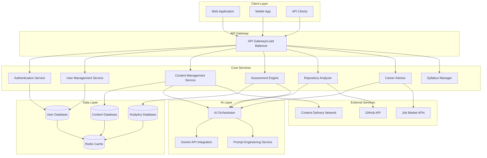
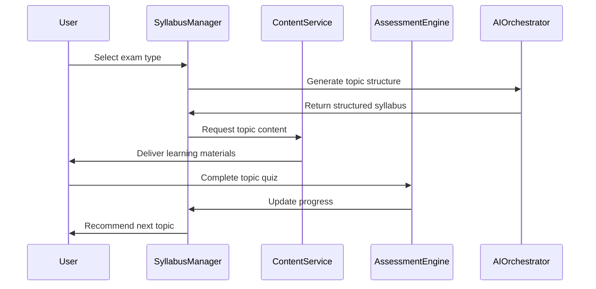
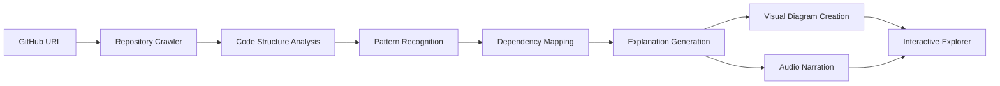
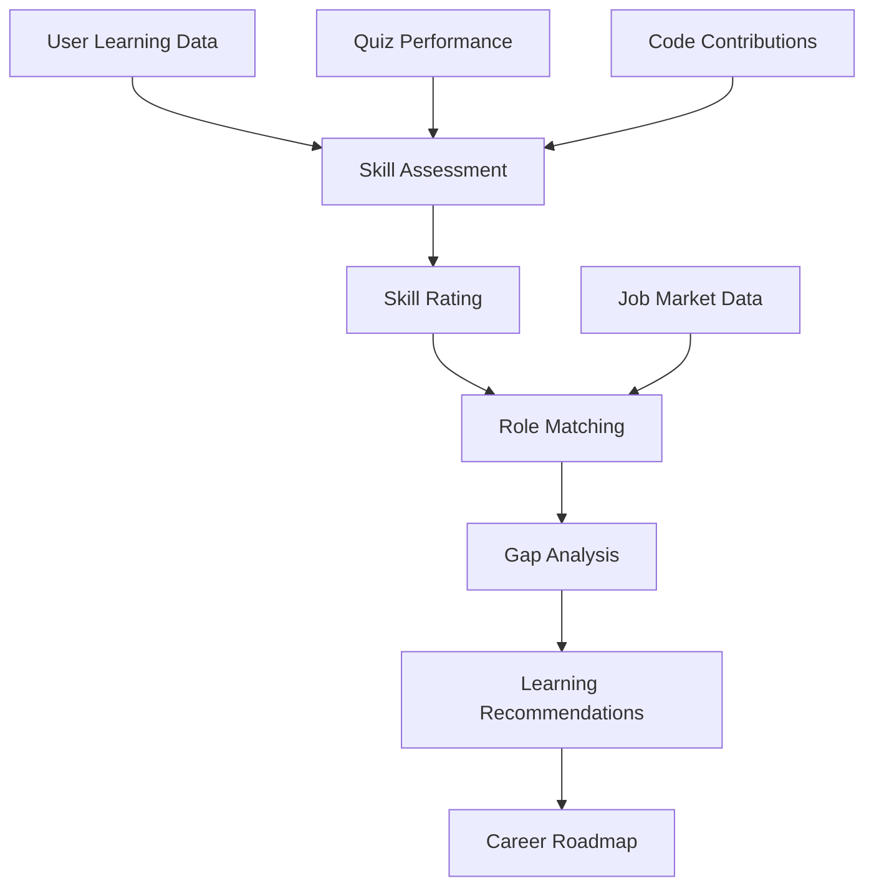
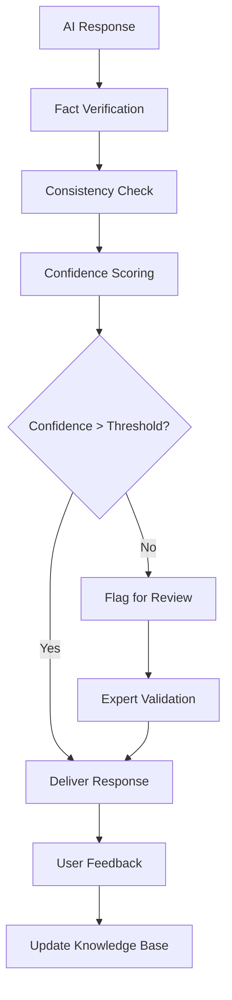
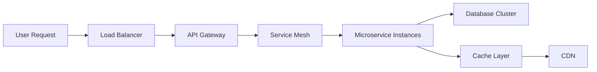
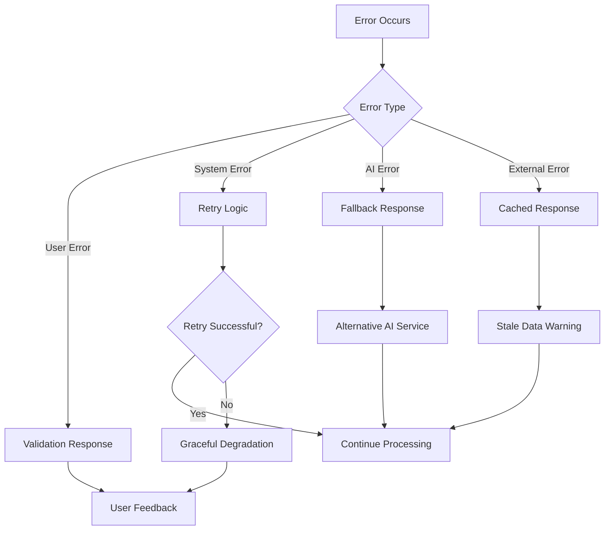

# Design Document: Sensei-AI

## Overview

Sensei-AI is a modular, AI-driven educational platform that leverages the Gemini API to provide personalized programming education, exam preparation, repository analysis, and career guidance. The system follows a microservices architecture with clear separation of concerns, enabling scalable and maintainable development.

The platform integrates multiple AI capabilities through a unified interface, providing structured learning paths, adaptive assessments, intelligent code analysis, and personalized career recommendations. The design emphasizes modularity, scalability, and accuracy through robust validation and hallucination prevention mechanisms.

## Architecture

### High-Level Architecture



### Component Architecture

The system follows a layered architecture with clear separation between presentation, business logic, AI processing, and data persistence layers.

## Components and Interfaces

### 1. Authentication Service

**Responsibilities:**
- User registration and login
- JWT token management
- Session handling
- Password security

**Key Interfaces:**
```typescript
interface AuthService {
  register(userData: UserRegistration): Promise<AuthResult>
  login(credentials: LoginCredentials): Promise<AuthResult>
  validateToken(token: string): Promise<TokenValidation>
  refreshToken(refreshToken: string): Promise<AuthResult>
}
```

### 2. User Management Service

**Responsibilities:**
- User profile management
- Learning progress tracking
- Preference management
- Achievement system

**Key Interfaces:**
```typescript
interface UserService {
  getProfile(userId: string): Promise<UserProfile>
  updateProfile(userId: string, updates: ProfileUpdates): Promise<UserProfile>
  getProgress(userId: string): Promise<LearningProgress>
  updateProgress(userId: string, progress: ProgressUpdate): Promise<void>
}
```

### 3. Content Management Service

**Responsibilities:**
- Educational content delivery
- Curriculum management
- Content versioning
- Multi-format content support

**Key Interfaces:**
```typescript
interface ContentService {
  getCurriculum(level: SkillLevel): Promise<Curriculum>
  getTopic(topicId: string): Promise<TopicContent>
  getTopicsByPath(pathId: string): Promise<Topic[]>
  updateContent(contentId: string, content: ContentUpdate): Promise<void>
}
```

### 4. Assessment Engine

**Responsibilities:**
- MCQ generation and management
- Adaptive difficulty adjustment
- Performance analytics
- Immediate feedback provision

**Key Interfaces:**
```typescript
interface AssessmentEngine {
  generateQuiz(topicId: string, difficulty: DifficultyLevel): Promise<Quiz>
  evaluateAnswer(questionId: string, answer: Answer): Promise<EvaluationResult>
  getPerformanceAnalytics(userId: string): Promise<PerformanceMetrics>
  adaptDifficulty(userId: string, performance: Performance): Promise<DifficultyLevel>
}
```

### 5. Repository Analyzer

**Responsibilities:**
- GitHub repository processing
- Code structure analysis
- Visual diagram generation
- Multi-modal explanation delivery

**Key Interfaces:**
```typescript
interface RepositoryAnalyzer {
  analyzeRepository(repoUrl: string): Promise<RepositoryAnalysis>
  generateExplanation(analysis: RepositoryAnalysis, mode: ExplanationMode): Promise<Explanation>
  createVisualDiagram(codeStructure: CodeStructure): Promise<Diagram>
  getInteractiveExploration(repoId: string): Promise<InteractiveExplorer>
}
```

### 6. Career Advisor

**Responsibilities:**
- Skill assessment and gap analysis
- Job role recommendations
- Market insights provision
- Learning path suggestions

**Key Interfaces:**
```typescript
interface CareerAdvisor {
  assessSkills(userId: string): Promise<SkillAssessment>
  recommendRoles(skills: SkillSet): Promise<JobRecommendation[]>
  analyzeSkillGaps(targetRole: JobRole, currentSkills: SkillSet): Promise<SkillGap[]>
  getMarketInsights(role: JobRole): Promise<MarketInsights>
}
```

### 7. AI Orchestrator

**Responsibilities:**
- Gemini API integration
- Prompt management and optimization
- Response validation and filtering
- Hallucination prevention

**Key Interfaces:**
```typescript
interface AIOrchestrator {
  processRequest(request: AIRequest): Promise<AIResponse>
  validateResponse(response: AIResponse): Promise<ValidationResult>
  optimizePrompt(prompt: Prompt, context: Context): Promise<OptimizedPrompt>
  preventHallucination(response: AIResponse, facts: FactBase): Promise<ValidatedResponse>
}
```

## Data Models

### Core Data Structures

```typescript
interface User {
  id: string
  email: string
  profile: UserProfile
  learningProgress: LearningProgress
  preferences: UserPreferences
  createdAt: Date
  updatedAt: Date
}

interface UserProfile {
  name: string
  skillLevel: SkillLevel
  learningGoals: string[]
  targetRoles: JobRole[]
  timezone: string
}

interface LearningProgress {
  completedTopics: string[]
  currentPath: string
  skillAssessments: SkillAssessment[]
  quizScores: QuizScore[]
  timeSpent: number
}

interface Topic {
  id: string
  title: string
  description: string
  content: TopicContent
  prerequisites: string[]
  difficulty: DifficultyLevel
  estimatedTime: number
}

interface Quiz {
  id: string
  topicId: string
  questions: Question[]
  difficulty: DifficultyLevel
  timeLimit: number
}

interface Question {
  id: string
  text: string
  options: string[]
  correctAnswer: number
  explanation: string
  difficulty: DifficultyLevel
}

interface RepositoryAnalysis {
  repoId: string
  structure: CodeStructure
  technologies: Technology[]
  complexity: ComplexityMetrics
  patterns: DesignPattern[]
  documentation: DocumentationQuality
}

interface SkillAssessment {
  userId: string
  skills: SkillRating[]
  strengths: string[]
  weaknesses: string[]
  recommendations: string[]
  assessedAt: Date
}
```

## Exam Mode Design

### Architecture

The exam preparation system provides structured, syllabus-driven learning with comprehensive topic coverage and progress tracking.

### Key Components

1. **Syllabus Parser**: Analyzes exam syllabi and creates structured topic hierarchies
2. **Progress Tracker**: Monitors completion status and time allocation
3. **Adaptive Scheduler**: Recommends study schedules based on exam dates
4. **Performance Analyzer**: Identifies weak areas requiring additional focus

### Implementation Flow



### Syllabus Processing

1. **Input Processing**: Parse exam syllabus documents and requirements
2. **Topic Extraction**: Use Gemini API to identify and structure topics
3. **Dependency Mapping**: Create prerequisite relationships between topics
4. **Time Estimation**: Calculate study time requirements for each topic
5. **Schedule Generation**: Create personalized study schedules

## GitHub Explainer Design

### Multi-Modal Explanation System

The repository analyzer provides comprehensive code understanding through multiple interaction modes.

### Core Components

1. **Repository Crawler**: Fetches and processes GitHub repository data
2. **Code Analyzer**: Analyzes code structure, patterns, and dependencies
3. **Explanation Generator**: Creates multi-modal explanations using Gemini API
4. **Visualization Engine**: Generates interactive diagrams and visual representations

### Processing Pipeline



### Explanation Modes

1. **Visual Mode**: Interactive diagrams showing code architecture, class relationships, and data flow
2. **Speaking Mode**: AI-generated audio explanations with natural language descriptions
3. **Interactive Mode**: Clickable code exploration with contextual explanations
4. **Summary Mode**: High-level overview with key insights and learning points

### Technical Implementation

- **Static Analysis**: Parse code structure without execution
- **Pattern Recognition**: Identify common design patterns and architectural styles
- **Dependency Analysis**: Map relationships between modules and components
- **Documentation Extraction**: Process README files and inline comments
- **Complexity Assessment**: Evaluate code complexity and maintainability

## Career and Job Readiness Analysis Design

### Intelligent Career Guidance System

The career advisor provides personalized guidance based on comprehensive skill analysis and market intelligence.

### Analysis Framework

1. **Skill Assessment Engine**: Evaluates technical and soft skills through multiple data sources
2. **Market Intelligence**: Integrates job market data and industry trends
3. **Gap Analysis**: Identifies skill deficiencies for target roles
4. **Learning Path Generator**: Creates personalized improvement plans

### Data Sources

- **Learning Progress**: Quiz scores, topic completion, time spent
- **Code Analysis**: Repository contributions and code quality metrics
- **Market Data**: Job postings, salary information, skill requirements
- **Industry Trends**: Emerging technologies and skill demands

### Assessment Methodology



### Recommendation Engine

1. **Skill Profiling**: Create comprehensive skill profiles from learning data
2. **Role Matching**: Match skills to job requirements using similarity algorithms
3. **Gap Identification**: Highlight missing skills for target positions
4. **Priority Ranking**: Rank skill gaps by importance and market demand
5. **Learning Path Creation**: Generate step-by-step improvement plans

## Accuracy and Hallucination Prevention

### Multi-Layer Validation System

The platform implements comprehensive measures to ensure AI-generated content accuracy and prevent hallucinations.

### Validation Strategies

1. **Fact Verification**: Cross-reference AI responses with authoritative sources
2. **Consistency Checking**: Ensure responses align with established knowledge bases
3. **Confidence Scoring**: Implement confidence thresholds for AI-generated content
4. **Human Review**: Flag uncertain content for expert validation
5. **Feedback Integration**: Learn from user corrections and feedback

### Implementation Approach



### Quality Assurance Measures

1. **Knowledge Base Maintenance**: Curate and update authoritative programming knowledge
2. **Response Validation**: Implement automated checks for common hallucination patterns
3. **Expert Review Process**: Establish workflows for content validation by domain experts
4. **User Feedback Loop**: Collect and integrate user corrections and suggestions
5. **Continuous Monitoring**: Track accuracy metrics and improve validation algorithms

### Specific Prevention Techniques

- **Code Validation**: Verify code examples through syntax checking and execution
- **Concept Verification**: Cross-reference programming concepts with official documentation
- **Historical Accuracy**: Validate historical information about technologies and frameworks
- **Best Practice Alignment**: Ensure recommendations follow industry best practices
- **Source Attribution**: Provide references for factual claims and recommendations

## Scalability Considerations

### Horizontal Scaling Architecture

The platform is designed for horizontal scaling to accommodate growing user bases and increasing computational demands.

### Scaling Strategies

1. **Microservices Architecture**: Independent scaling of individual services
2. **Load Balancing**: Distribute traffic across multiple service instances
3. **Database Sharding**: Partition data across multiple database instances
4. **Caching Strategy**: Implement multi-level caching for improved performance
5. **CDN Integration**: Global content delivery for reduced latency

### Performance Optimization



### Infrastructure Design

1. **Container Orchestration**: Use Kubernetes for service deployment and management
2. **Auto-scaling**: Implement horizontal pod autoscaling based on metrics
3. **Database Optimization**: Use read replicas and connection pooling
4. **Caching Strategy**: Multi-tier caching with Redis and application-level caches
5. **Monitoring**: Comprehensive observability with metrics, logs, and traces

### Resource Management

- **CPU Optimization**: Efficient algorithm implementation and parallel processing
- **Memory Management**: Optimize data structures and implement garbage collection
- **Storage Efficiency**: Compress content and implement data archiving strategies
- **Network Optimization**: Minimize API calls and implement request batching
- **Cost Management**: Monitor resource usage and implement cost optimization strategies

## Error Handling

### Comprehensive Error Management

The platform implements robust error handling to ensure reliable user experiences and system stability.

### Error Categories

1. **User Input Errors**: Invalid data, authentication failures, permission issues
2. **System Errors**: Service unavailability, database connection issues, timeout errors
3. **AI Service Errors**: API rate limits, model unavailability, response validation failures
4. **External Service Errors**: GitHub API failures, job market data unavailability
5. **Data Consistency Errors**: Synchronization issues, data corruption, version conflicts

### Error Handling Strategy



### Recovery Mechanisms

1. **Retry Logic**: Implement exponential backoff for transient failures
2. **Circuit Breakers**: Prevent cascade failures through service isolation
3. **Fallback Responses**: Provide alternative responses when primary services fail
4. **Graceful Degradation**: Maintain core functionality during partial system failures
5. **Data Recovery**: Implement backup and restore procedures for critical data

## Testing Strategy

*A property is a characteristic or behavior that should hold true across all valid executions of a system—essentially, a formal statement about what the system should do. Properties serve as the bridge between human-readable specifications and machine-verifiable correctness guarantees.*

Now I need to analyze the acceptance criteria from the requirements to create correctness properties. Let me use the prework tool to systematically analyze each acceptance criterion for testability.

<function_calls>
<invoke name="prework">
<parameter name="featureName">sensei-ai

## Correctness Properties

*A property is a characteristic or behavior that should hold true across all valid executions of a system—essentially, a formal statement about what the system should do. Properties serve as the bridge between human-readable specifications and machine-verifiable correctness guarantees.*

Based on the prework analysis and property reflection to eliminate redundancy, the following properties validate the core system behaviors:

### Property 1: Curriculum Structure Completeness
*For any* curriculum query, the Learning Platform should return paths for all three skill levels (beginner, intermediate, advanced) with proper prerequisite information for advanced topics.
**Validates: Requirements 1.1, 1.5**

### Property 2: Topic Progression Ordering
*For any* learning path, topics should be presented in logical prerequisite order where no topic appears before its dependencies.
**Validates: Requirements 1.2**

### Property 3: Progress Tracking Consistency
*For any* user learning activity (topic completion, quiz taking, exam preparation), progress should be accurately recorded and maintained consistently across all platform features.
**Validates: Requirements 1.3, 2.3, 6.3**

### Property 4: Topic Unlocking Mechanism
*For any* completed topic, the next topic in the sequence should become available while maintaining prerequisite constraints.
**Validates: Requirements 1.4**

### Property 5: Syllabus Generation Accuracy
*For any* exam type, the Syllabus Manager should generate comprehensive topic lists that are properly organized by subject areas and difficulty levels.
**Validates: Requirements 2.1, 2.2**

### Property 6: Time Estimation Provision
*For any* topic or learning path, the system should provide reasonable time estimates that help users plan their study schedules.
**Validates: Requirements 2.4**

### Property 7: Intelligent Recommendation Generation
*For any* user context (exam dates, availability, skill gaps, career goals), the system should generate personalized recommendations that are relevant and actionable.
**Validates: Requirements 2.5, 5.2, 5.4, 8.3**

### Property 8: Quiz Generation and Feedback
*For any* completed topic, relevant MCQ quizzes should be generated with immediate feedback and explanations for incorrect answers.
**Validates: Requirements 3.1, 3.2, 3.3**

### Property 9: Adaptive System Behavior
*For any* user performance pattern, the system should adapt quiz difficulty, content delivery, and support provision to match user needs.
**Validates: Requirements 3.4, 8.1, 8.2, 8.4**

### Property 10: Analytics and Data Persistence
*For any* quiz attempt or learning activity, results should be stored persistently and made available through performance analytics and data export capabilities.
**Validates: Requirements 3.5, 6.5**

### Property 11: Repository Analysis Completeness
*For any* valid GitHub repository URL, the Repository Analyzer should perform structure analysis and provide multi-modal explanations (text, audio, visual) with interactive exploration capabilities.
**Validates: Requirements 4.1, 4.2, 4.3, 4.5**

### Property 12: Code Pattern Recognition
*For any* analyzed repository containing known programming patterns, the explanations should highlight and explain these patterns appropriately.
**Validates: Requirements 4.4**

### Property 13: Skill Assessment Accuracy
*For any* user with learning progress and quiz performance data, the Career Advisor should generate accurate skill assessments and identify relevant skill gaps.
**Validates: Requirements 5.1, 5.3**

### Property 14: Market Intelligence Provision
*For any* job role query, the Career Advisor should provide current market insights and salary expectations based on available data.
**Validates: Requirements 5.5**

### Property 15: User Management Completeness
*For any* user account creation or profile update, the system should provide secure authentication, establish personalized profiles, and maintain preference settings.
**Validates: Requirements 6.1, 6.2, 6.4**

### Property 16: Content Format Support
*For any* supported content format (text, video, interactive elements), the platform should deliver content reliably with offline access capabilities where applicable.
**Validates: Requirements 7.2, 7.4**

### Property 17: Content Update Propagation
*For any* content update, affected users should be notified and their learning paths should be updated accordingly.
**Validates: Requirements 7.3**

### Property 18: Personalized Messaging
*For any* user behavior pattern, the system should generate appropriate study reminders and motivational messages based on individual learning patterns.
**Validates: Requirements 8.5**

## Testing Strategy

### Dual Testing Approach

The Sensei-AI platform requires comprehensive testing through both unit tests and property-based tests to ensure correctness and reliability.

**Unit Testing Focus:**
- Specific examples demonstrating correct behavior for each component
- Edge cases and error conditions (invalid inputs, network failures, API limits)
- Integration points between services (authentication flows, data synchronization)
- AI response validation and hallucination prevention mechanisms

**Property-Based Testing Focus:**
- Universal properties that hold across all valid inputs and user scenarios
- Comprehensive input coverage through randomized test generation
- Validation of adaptive behaviors under various user performance patterns
- Cross-component consistency verification

### Property-Based Testing Configuration

**Framework Selection:**
- **TypeScript/JavaScript**: Use `fast-check` library for property-based testing
- **Python**: Use `hypothesis` library for comprehensive property testing
- **Test Configuration**: Minimum 100 iterations per property test to ensure statistical confidence

**Test Tagging Format:**
Each property-based test must include a comment referencing its design document property:
```typescript
// Feature: sensei-ai, Property 1: Curriculum Structure Completeness
```

**Implementation Requirements:**
- Each correctness property must be implemented by exactly one property-based test
- Property tests should generate diverse, realistic test data
- Tests must validate both positive cases (expected behavior) and negative cases (error handling)
- All property tests must be automated and integrated into the CI/CD pipeline

### Testing Coverage Strategy

1. **Component-Level Testing**: Unit tests for individual service functionality
2. **Integration Testing**: Verify interactions between services and external APIs
3. **Property Testing**: Validate universal system behaviors across all scenarios
4. **Performance Testing**: Ensure system meets response time and scalability requirements
5. **Security Testing**: Validate authentication, authorization, and data protection
6. **AI Quality Testing**: Verify accuracy and prevent hallucinations in AI-generated content

### Continuous Quality Assurance

- **Automated Testing**: All tests run automatically on code changes
- **Quality Gates**: Minimum test coverage and property test pass rates required for deployment
- **Monitoring**: Real-time monitoring of system behavior in production
- **Feedback Integration**: User feedback incorporated into test case generation and validation